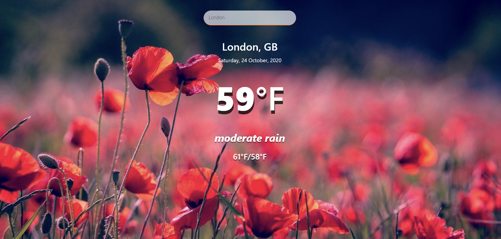

# weather-web-app

## Overview
A weather dashboard that will run in the browser and feature dynamically weather updates, which will allow users to view current weather in their city. With a third-party API that allows user to access their data and functionality by making requests with specific parameters to a URL.

## Technology Used
 - Vanilla Javascript
 - Bootstrap
 - Openweathermap API
 - CSS

 ## Future Improvements

 - Adding functionallity to allow users to view past/future weather dates.
 - Save searches to view later.
 - Allow users to be notified about server weather changes.

## View Site

